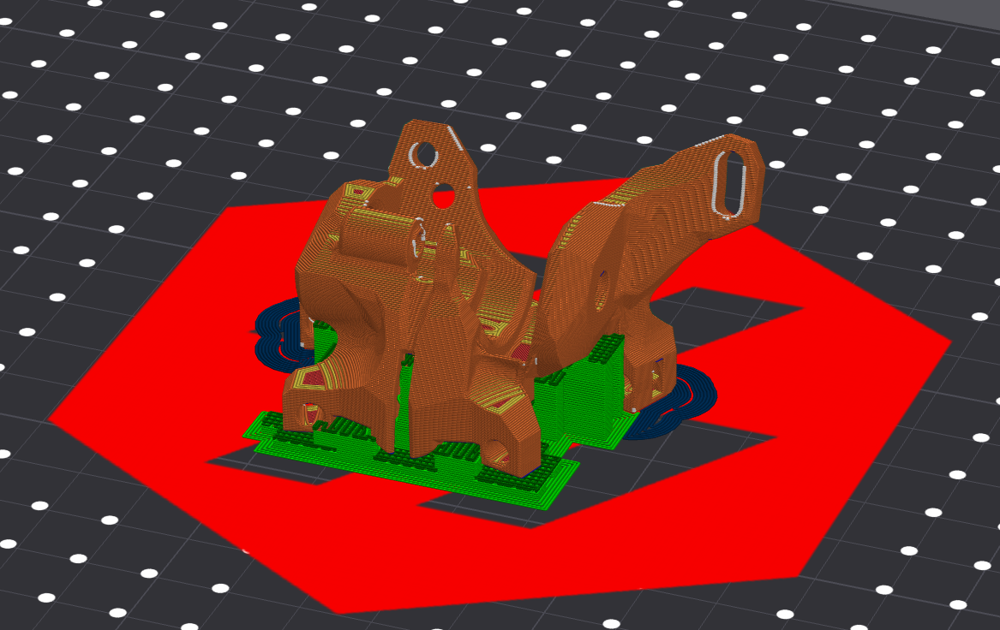

# Rhex_Rhino_Extruder [WIP]
## 40T and 20T Worm-Extruder with BMG Drive made for the Archetype Eco System.

**Archetype GitHub:**
> https://github.com/Armchair-Heavy-Industries/Archetype

## PROJECT GOALS:
- I want to make an reliable Extruder which is driven with an Worm Gear.
- Pretty much to get an Extruder which can probably compete with the allready supported ones inside the Archetype System.

## Printed parts guide
- Recommended print settings: 4 walls, 40% infill (or more), 0.2mm layer height, 0.4mm nozzle
- Recommended material: **ABS or better**
- Make sure to use Supports! *I would not recommend Organic or Tree Supports*

  

## BOM
WIP

# Known Problems
### 40T Version
- Ecas Holder breaking
- Top Speed Grip issues due to smooth idler

### 20T Version
- 1 Start consistency issues
- 1 Start print quality issues over time
- 1 Start retract issues

#

*The 40T Version got it's inspiration from Annex DFA:*
> https://github.com/Annex-Engineering/Folded_Ascender-Extruder
