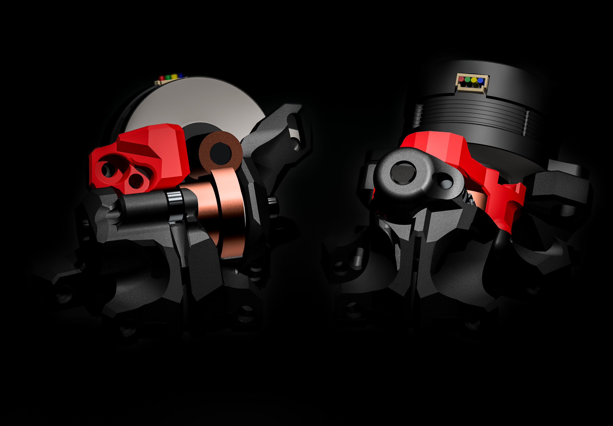

# Rhex_Rhino_Extruder [WIP]
40T and 20T Worm-Extruder made for the Archetype Eco System.

--> Archetype GitHub: https://github.com/Armchair-Heavy-Industries/Archetype

The 40T Version got it's inspiration from Annex DFA 

--> https://github.com/Annex-Engineering/Folded_Ascender-Extruder

# PROJECT GOALS:
- I want to make an reliable Extruder which is driven with an Worm Gear.
- Pretty much to get an Extruder which can probably compete with the existing ones inside the Archetype System.
- Making an Extruder which doesn`t Suck
- Making an Extruder which realy works
- Spend a shit ton of time for something which other people allready figured out but yeah
- I hate my life enough to make that stuff

# Known Problems
- What? There are no problems. Never. Realy. Just a few.
- 
# IMAGES

#
